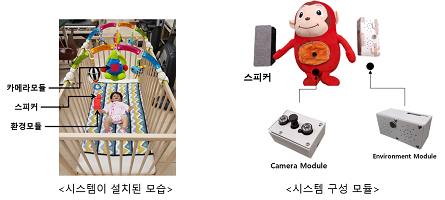
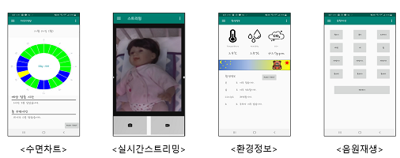

# Infant_Sleep_Management_System
> 학부생 3학년 동안 진행한 프로젝트, 스마트기기를 이용한 영아수면관리시스템 중 '영상처리서버 및 데이터베이스 구축 관리'를 담당함

## 제품 사진

## 개발 기간
* 2019.03.02.~12.29. (약10개월)

## 주요 기능
* 영아 맞춤별 수면패턴 파악
* 자는 시간, 깨는 시간 예측
* 적정 수면습관 가이드
* 수면환경 모니터링
* 실시간 모니터링
* 아기 깨면 자동음원 재생

## 담당한 부분
* 영상처리서버 및 데이터베이스 구축 관리
    * 영상처리서버 구축
    * Database 설계 및 구축
    * 수면 상태 판단 알고리즘 구현
    * 모바일 앱(수면테이블, 실시간영상) 구현
    
    상세내용은 링크 참조 
    
    https://drive.google.com/file/d/1vDEU6LXjwh6c6If4AgYxFRQyLB15MLk5/view?usp=sharing

## Development Setup
* 사용 센서
    * 라즈베리파이, 적외선카메라, 블루투스 스피커, 아두이노, 온습도센서, 소리감지센서, CO2농도센서, 조도센서
* 영상처리서버 : Amazon EC2 (Ubuntu 16.04)
* DB서버 : AWS RDS (MySQL)
* 프로그래밍 언어
    * 수면판단기능 구현 : Python
    * 수면 모니터링 웹 구현 : HTML/CSS/JS, PHP
    * 수면 관리 안드로이드 앱 구현 : Java
* 라이브러리
    * OpenCV 3.3

## Release History

* 1.1.0
    * second
    * 하드웨어 관련 코드 추가

* 1.0.0
    * first
    * 개발 완료

## Contact

김준혁 – kimjunhyeok.it@gmail.com
