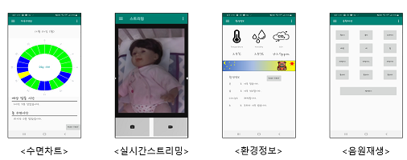

# Infant_Sleep_Management_System
>학부생 3학년 1학기부터 2학기까지 진행한 영아수면관리시스템

## Installation
-

## Usage example

라즈베리파이 카메라로부터 영아의 영상을 입력받고, Amazon EC2에서 영아의 전신, 얼굴, 눈을 인식하여 수면여부를 판단함

## Development setup

우분투 16.04:

Amazon EC2에서 동작시킴

OpenCV 3.3으로 설치함

## Release History

* 1.1.0
    * second
    * 창 버튼 및 크기 조절 수정

* 1.0.0
    * first
    * 개발 완료

## Meta

김준혁 – wnsgur1198@naver.com

## Contributing

1. Fork it (<https://github.com/yourname/yourproject/fork>)
2. Create your feature branch (`git checkout -b feature/fooBar`)
3. Commit your changes (`git commit -am 'Add some fooBar'`)
4. Push to the branch (`git push origin feature/fooBar`)
5. Create a new Pull Request

<!-- Markdown link & img dfn's -->
